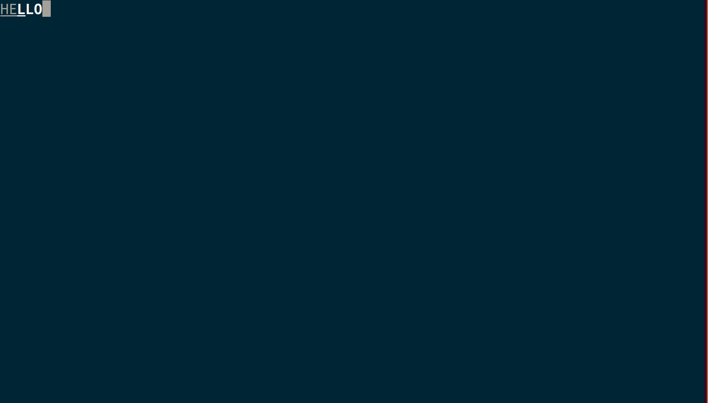
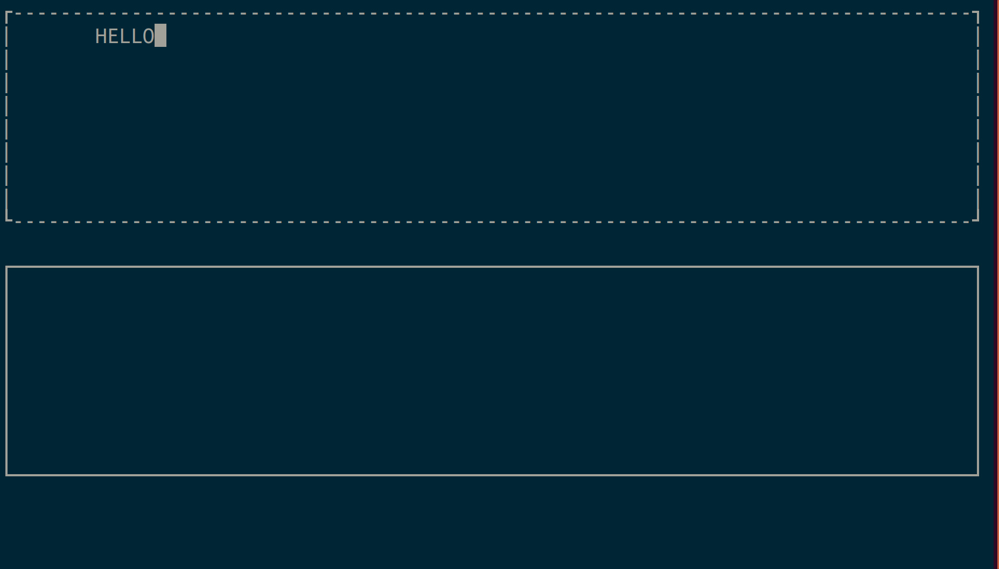
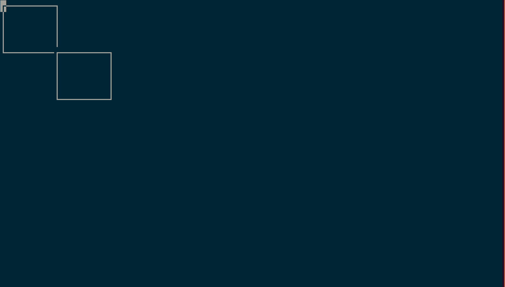

# CPP NCURSES

This is a note on how to use ncurses as a library. This library is very handy to display information on the terminal and the license is of MIT.





## Compiling and Running
```
mkdir build
cd build
cmake ..
make
./test
```